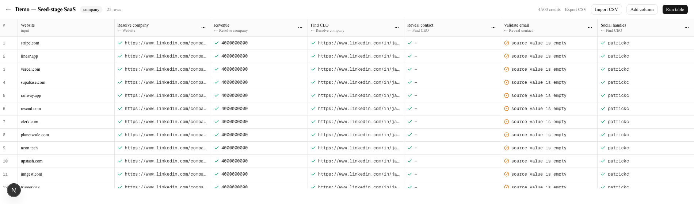
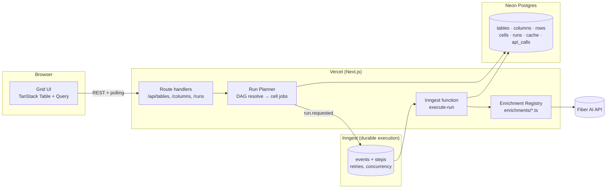

# OpenCeramic

[](https://github.com/ojas-2003/OpenCeramic/actions/workflows/ci.yml)

An open-source, Clay-style enrichment spreadsheet built entirely on
[Fiber AI](https://api.fiber.ai). A table has rows and columns; **enrichment
columns declare their inputs as mappings to other columns**, which makes the
table a DAG. A run is planned synchronously — topological sort, cell statuses,
credit estimate — and executed by a durable Inngest function that walks the
graph level by level, dispatching cells to adapters in chunks with caching,
retries and partial-failure semantics.

The spreadsheet is only the rendering. The engine is the thing.

**Live demo:** https://open-ceramic-test.vercel.app

### The demo runs on recorded fixtures, and here is why

Fiber issues sandbox keys (`sk_test_…`) self-serve, and they never charge
credits. Probed with valid request bodies, **six of the seven operations behind
this project's adapters return 501**, as do the Mosaic import and both account
endpoints:

| Operation | Sandbox |
|---|---|
| `peopleSearch` | **200**, returns synthetic data |
| `kitchenSinkCompany` | 501 |
| `getCompanyRevenue` | 501 |
| `getTalentFlow` | 501 |
| `startBatchContactDetails` | 501 |
| `emailBounceDetection` | 501 |
| `socialMediaLookupTrigger` | 501 |
| `startMosaic` | 501 |
| `getOrgCredits`, `getRateLimits` | 501 |

```
POST /v1/kitchen-sink/company
{"message":"Sandbox mode is not yet available for this endpoint."}
```

Only `peopleSearch` responds, and it returns synthetic data (`Jane Doe`,
`jane-doe-sandbox`). So the deployed demo runs with `FIBER_FAKE=1`, serving
responses recorded from `openapi.json`-typed fixtures.

One trap worth flagging: **body validation runs before the sandbox check**, so
probing an endpoint with an incomplete body returns `400 body/x Required` and
looks reachable. Only a valid body reveals the 501. That is how I originally
undercounted this.

**What that does and does not mean.** The DAG resolution, level ordering,
caching, retry/backoff, credit accounting, skip semantics and durable execution
are all real and all exercised — only the HTTP responses are recorded. The
adapters call the live endpoints unchanged; see
[`fiber.email.validate.ts`](src/enrichments/fiber.email.validate.ts), which is
34 lines and hits `POST /v1/validate-email/single`. One environment variable
flips it:

```bash
FIBER_FAKE=0   # with a live sk_live_ key
```

The honest residual risk is **field mapping**: my adapters read
`preferred_name`, `linkedin_primary_slug` and so on out of `kitchenSinkCompany`'s
83-field response, chosen from the OpenAPI schema without ever seeing a live
payload. When I *could* check one against the real API — `peopleSearch` — I had
invented three of its field names (`full_name`/`linkedin_url`/`location_name`
where the API returns `name`/`url`/`locality`), and I rebuilt that fixture from a
recorded response. Assume the other five are similarly wrong until a live key
proves otherwise. It is a one-line change per adapter, and it touches no engine,
planner or schema code.



## Try it in 60 seconds

```bash
pnpm install
cp .env.example .env.local     # set DATABASE_URL; FIBER_FAKE=1 is the default
pnpm db:migrate
pnpm inngest:dev               # terminal 1 (Docker)
pnpm dev                       # terminal 2
```

Then at <http://localhost:3000>:

1. **Load demo table** — 25 SaaS companies, seven enrichment columns, four DAG levels
2. **Run table** — you get a price first: *"Run 175 cells (0 cached) · est. 550 credits · balance 4,900"*. Nothing is spent until you confirm.
3. **Click any cell** — full JSON, plus provenance: credits, latency, cache hit, and the `api_call_id` of the exact request behind the value.

Then press **Run table** again. It costs **0 credits** and finishes instantly —
everything is cached.

The amber ⊘ column is not a bug. `Reveal contact` found nothing for those
profiles, so `Validate email` **skipped with a stated reason** rather than
failing on a null email or leaving a silent blank. That distinction is the point
of the engine.

## Architecture



**The planner** ([src/engine/planner.ts](src/engine/planner.ts)) builds an edge
list from every column's `config.inputs`, Kahn-sorts it into levels, decides
which cells to touch (`done` cells are left alone unless `force`), prices the
run against the cache in **one** lookup, and refuses anything over
`MAX_CREDITS_PER_RUN` **before writing a single row** — so a rejected plan leaves
no trace. `topoSortLevels` and `downstreamOf` are pure functions with no database
in sight.

**The executor** ([src/engine/executor.ts](src/engine/executor.ts)) is a thin
Inngest wrapper. Levels run in sequence because each consumes what the last
produced; columns inside a level run together because the planner proved they are
independent. All the logic lives in
[src/engine/process.ts](src/engine/process.ts) as pure functions — which is why
**all 43 executor tests run with no database and no Inngest harness**.

Cells are chunked (10 per step for sync, `batchSize` for batch) because Inngest
caps steps per run and one step per cell would blow that on a 200×4 table. Async
adapters get one durable step per `start` and per `poll`, with `step.sleep`
between, so a poll loop survives a redeploy.

**The cell is the job record.** Its primary key is `(row_id, column_id)`, so
every write is an upsert and a redelivered event is harmless. There is no jobs
table.

## Add an enrichment in 30 lines

This is [`src/enrichments/fiber.email.validate.ts`](src/enrichments/fiber.email.validate.ts),
complete and unedited:

```ts
const inputs = z.object({ email: z.string().min(1) });
const output = z.object({ deliverable: z.boolean(), status: z.string() });

export const fiberEmailValidate: Enrichment<Input, Output> = {
  id: "fiber.email.validate",
  version: 1,
  label: "Validate email",
  description: "Check whether an email address is deliverable before you send to it.",
  entity: "any",
  mode: "sync",
  inputs,
  output,
  outputFields: [
    { key: "deliverable", label: "Deliverable", type: "string" },
    { key: "status", label: "Status", type: "string" },
  ],
  estimateCredits: () => 1,
  cacheKey: (input) => `fiber.email.validate:1:${normalizeEmail(input.email)}`,

  async run(input, ctx) {
    const { data } = await ctx.fiber.call("/v1/validate-email/single", "post", {
      email: normalizeEmail(input.email),
    });
    const result = data.output;
    return { deliverable: result.verdict === "ok", status: result.verdict };
  },
};
```

Plus one line in [`src/enrichments/index.ts`](src/enrichments/index.ts):

```ts
register(fiberEmailValidate);
```

That is the whole integration. **`src/engine/**` never imports an adapter** —
it resolves them through the registry, and a script asserts that. The registry
also validates at *register* time that the declared `mode` matches exactly the
methods implemented (`sync`→`run`, `batch`→`runBatch`, `async`→`start`+`poll`),
so a mismatch is a boot crash rather than a cell that fails halfway through a
paid run.

The add-column picker needs no wiring either: it probes the Zod schema to learn
which inputs are required and what they accept, so a new adapter's UI is correct
the day it lands.

### On `@fiberai/sdk`

The transport **is** Fiber's official SDK. `FiberHttpClient` builds a client with
`createClient(createConfig({ baseUrl }))` and issues every request through it.

The SDK is wrapped rather than used directly, because `FiberClient` — a
two-method interface — is what the rest of the app depends on, and the wrapper
adds four things the engine needs that no SDK provides:

1. **An `api_calls` row per request** — endpoint, request hash, status, latency,
   credits. This is what makes `provenance.api_call_id` on a cell point at the
   exact call that produced it, and what lets a run reconcile `actual_credits`
   from a ledger rather than from summed guesses.
2. **Credit extraction from `chargeInfo`**, a five-variant discriminated union
   (`charged-now`, `charged-for-async-process`, `credits-refunded`,
   `charging-later`, `free`).
3. **A stable request hash** with sorted keys, excluding the API key, so the same
   lookup under a different key collapses to one cache entry.
4. **A swappable fake.** `FakeFiberClient` implements the same interface, which
   is why 183 tests run with no network, no database and no key.

One thing the swap surfaced, worth knowing if you wrap this SDK yourself: **it
does not re-throw a transport failure.** A rejected `fetch` resolves with
`response: undefined` rather than throwing, so a naive `response.ok` raises a
`TypeError` — which an error taxonomy would classify as *terminal*, permanently
failing a cell that a retry would have fixed. `FiberHttpClient` checks for the
missing response and maps it to a retryable network error. There is a test for it.

### The seven shipped adapters

| Adapter | Mode | Fiber operation | Credits |
|---|---|---|---|
| `fiber.company.kitchenSink` | sync | `kitchenSinkCompany` | 2 |
| `fiber.company.revenue` | sync | `getCompanyRevenue` | 4 |
| `fiber.people.findAtCompany` | sync | `peopleSearch` | 1 |
| `fiber.contact.reveal` | **batch** | `startBatchContactDetails` + poll | 5 |
| `fiber.email.validate` | sync | `emailBounceDetection` | 1 |
| `fiber.social.handles` | **async** | `socialMediaLookupTrigger` + poll | 6 |
| `fiber.company.talentFlow` | sync | `getTalentFlow` | 5 |

All three run modes, and they chain: the demo table is four levels deep.

**Why these.** Six of them are the obvious prospecting chain — resolve a company,
find a person, get their contact, verify it. They were chosen to exercise every
run mode and to depend on each other, so the DAG has something real to order.

`talentFlow` is there for a different reason. Reading through Fiber's catalogue,
it is the most distinctive thing in it: **where a company hires from, and where
its alumni go** — an aggregate over up to 10,000 profiles rather than a row of
attributes. It answers a question no company record contains ("who do we lose
engineers to"), and it stress-tests the cell contract in a way the others do not,
since the value is a *ranking* that has to collapse into one legible line.

It also costs one file to add, which is the claim this README makes about the
adapter interface, demonstrated rather than asserted.

### Mosaic: Fiber repairs the CSV before it becomes rows

The import dialog has a second mode. Instead of parsing a clean file in the
browser, you give it a link to a messy one — CSV, TXT, XLSX or a public Google
Sheet — and **Fiber Mosaic** (`startMosaic` / `pollMosaic`) normalises headers,
repairs partial records and resolves mixed identifier types before a single row
is created. The healed columns become input columns and the chain runs on them.

Two things about it are worth calling out:

- **It is a row source, not an enrichment.** It creates rows rather than filling
  cells, so it lives in `src/lib/mosaic.ts` rather than behind the `Enrichment`
  interface — the distinction DESIGN.md §5.2 draws.
- **It takes a public URL, not an upload.** Fiber fetches the file itself, so
  this path asks for a link and the plain-file import stays for local CSVs. That
  is a real constraint of the API, not a shortcut.

Still unbuilt, in the order I would add them: `getScoutingReport`,
`getDepartmentSize`, and `stealthFoundersSearch` as another row source.

## Failure semantics

The difference between these four is the thing most enrichment tools get wrong.

| Cell state | Means | Example |
|---|---|---|
| `done`, value | The adapter returned data | A LinkedIn URL was resolved |
| `done`, **`value: null`** | Fiber looked and **found nothing** | No contact exists for that profile |
| `failed` | The call itself failed terminally | 400 bad input, 402 out of credits |
| `skipped` | An **input** was unusable, so this never ran | Upstream failed, was skipped, or was empty |

"No data found" is a **success**, not a failure — otherwise every unfindable
email looks like a bug. And a skipped cell records *why*:

```json
{ "skipped_because": { "column_id": "…", "reason": "source value is empty" } }
```

**Retryable vs terminal:** 429, 5xx, network and timeout are retried (3 attempts,
1s/4s/10s backoff). Every 4xx is terminal, including 402 — hammering a drained
account helps nobody. 501 is terminal too, which we learned the hard way: Fiber
returns it for endpoints sandbox does not cover, and retrying burned three
attempts per cell.

A single cell's error **never escapes its chunk**. The only thing allowed to
propagate out of a step is infrastructure failure, because that is the only case
where retrying the whole step is right.

## Caching and idempotency

- **Cache key** = `id:version:normalized(inputs)`, so `https://www.Acme.com/`
  and `acme.com` are one lookup. The version pins the adapter contract, so a
  changed output shape cannot serve stale values.
- **Null results are cached** — you should not pay twice to rediscover the same
  absence.
- **The API key is excluded from the request hash**, so the same lookup under a
  different key still collapses to one entry.
- **Every cell write is an upsert on `(row_id, column_id)`.** A redelivered
  Inngest event rewrites the same row.
- **Runs resume.** A default run only touches non-`done` cells. This is not
  theoretical: a mid-run crash during development left 75 of 150 cells pending,
  and re-running planned exactly those 75.
- **`actual_credits` is summed from `api_calls`**, deduplicated by id — not from
  provenance, so a cell written twice is not billed twice.

**On atomicity, deliberately.** `drizzle-orm/neon-http` speaks Neon's HTTP
protocol, which has no interactive transactions, so `upsertCells` is *not* atomic
across a batch: a chunk of 500 can partially apply. That is a considered trade,
not an oversight. Because every write is an upsert keyed on
`(row_id, column_id)`, a partial batch is not corruption — it is a subset of the
work, and the next run re-plans exactly the cells that did not land. Choosing
`neon-http` over the WebSocket driver keeps cold starts low on serverless, which
matters more here than atomicity the cell key already makes unnecessary.

## Design decisions

| Decision | Choice | Why | Rejected |
|---|---|---|---|
| Execution | **Inngest** | Vercel functions time out; 200×4 is 800 calls over minutes. Durable steps, retries, per-key concurrency, `step.sleep` for polling. | A Postgres `SKIP LOCKED` queue drained by a self-reinvoking route — understood, but fragile on serverless and ~3 hours of plumbing that is not the interesting part. |
| Source of truth | **Postgres, cells as rows** | Status must survive crashes and be queryable ("all failed cells in column X"). JSONB values keep the schema stable as output shapes vary. | One JSON blob per table — trivial to read, impossible to update from 800 concurrent workers. |
| Client updates | **Poll every 1.5s** | One endpoint, one query, no infrastructure. Runs take minutes; sub-second latency buys nothing. | SSE/Realtime — nicer, but a demo that flakes on WebSockets is worse than one that polls. |
| Fiber client | **Types generated from `openapi.json`** | End-to-end typed, drift-proof. | Hand-written DTOs. |
| Grid | **TanStack Table + Virtual** | Headless and virtualized; 202 rows render as 34 DOM nodes. | AG Grid — heavier, license friction. |

## Running locally

| Variable | Purpose |
|---|---|
| `DATABASE_URL` | Neon connection string |
| `FIBER_API_KEY` | Server-only. Never exposed to the browser, never in a `NEXT_PUBLIC_*` var. |
| `FIBER_FAKE` | `1` serves recorded fixtures instead of the live API |
| `INNGEST_DEV` | `1` points the SDK at the local dev server |
| `MAX_CREDITS_PER_RUN` | Plans above this are refused before anything is written |
| `CACHE_TTL_SECONDS` | Default 7 days |

```bash
pnpm dev            # app on :3000
pnpm inngest:dev    # Inngest dev server on :8288, in Docker
pnpm test           # 177 tests, ~0.5s
pnpm typecheck
pnpm build
pnpm db:migrate     # apply migrations
pnpm db:seed        # demo table from the CLI
pnpm db:studio      # browse the database
```

**On API keys.** See [the note above](#the-demo-runs-on-recorded-fixtures-and-here-is-why)
on sandbox coverage and `FIBER_FAKE`. Sandbox keys come from
`createSandboxApiKey` (`POST /v1/api-keys/create-sandbox`) and never charge
credits.

## Deploying

**Vercel**

1. Import the repo. Framework preset: Next.js. Build `pnpm build`.
2. Environment variables: `DATABASE_URL`, `FIBER_API_KEY`, `FIBER_BASE_URL`,
   `MAX_CREDITS_PER_RUN`, `CACHE_TTL_SECONDS`. **Do not** set `INNGEST_DEV` or
   `FIBER_FAKE=1` in production.
3. Run `pnpm db:migrate` against the production `DATABASE_URL` once.

**Inngest Cloud**

1. Add the Inngest integration from the Vercel marketplace, or set
   `INNGEST_EVENT_KEY` and `INNGEST_SIGNING_KEY` by hand from the Inngest
   dashboard.
2. Sync the app at `https://<your-app>.vercel.app/api/inngest`.
3. Confirm `execute-run` appears in the Inngest dashboard.

Verify by loading the demo table on production and running it.

## Tests

**183 tests, no database, no network, no Inngest harness.** They run in about
half a second.

| Area | Covers |
|---|---|
| `tests/engine/planner.test.ts` | Topological levels, diamonds, cycles, scope, `force`, cache exclusion, over-budget, and that a refused plan writes nothing |
| `tests/engine/executor.test.ts` | Cache hits, skip reasons, retry-then-succeed, terminal errors, null results, batch positional mapping, async poll timeout, concurrency limits, dotted input resolution |
| `tests/enrichments/contract.test.ts` | Every adapter: unique `fiber.*` id, mode matches implemented methods, output parses, cache keys stable under normalisation, estimates match fixture charges |
| `tests/fiber/*` | Request hashing stable across key order, error taxonomy, credit extraction, fixtures typechecked against the generated OpenAPI types |
| `tests/api/columns.test.ts` | Column validation: bad adapter, wrong entity, unmapped input, unknown source, self-reference, cycle |
| `tests/lib/mosaic.test.ts` | Mosaic start/poll, healed-CSV download and parse, expired link, column cap |

### One end-to-end test

`pnpm test:e2e` drives the real stack in a browser — Next.js, Postgres and the
Inngest dev server — through the journey a reviewer takes: load the demo table,
run it, and assert **every cell reaches a terminal state**, then that re-running
does not redo work that already succeeded.

A second spec covers creating and deleting a table, including that the row is
gone from the server after a reload rather than only from the client cache.

Both are deliberately separate from `pnpm test`. Those 195 unit tests run with no
network, no database and no key, and that property is worth protecting.

It found a real bug on its first green run. `RunConfirmDialog` keys its dry-run
preview on the request, and two runs of the same scope produce an identical key —
so reopening the dialog after a run served the *previous* estimate from cache,
on the one screen whose entire purpose is telling you what you are about to
spend. Fixed by making that query always refetch.

The engine is testable because dependencies are injected: the planner takes
`{ db, registry, cacheLookup }`, and the executor's core takes
`{ fiber, cache, logger }`. Swapping in a fake client and an in-memory cache is
the whole setup.

## What I would do next

- **Webhook completion** for async endpoints instead of polling
- **Trackers / Saved Search as auto-refreshing row sources** — new prospects
  appear and enrich themselves
- **Formula and AI columns**; conditional runs ("only enrich if revenue > $10M")
- **`KitchenSinkProfile` resolving a person from an email alone**, so a table
  seeded with only email addresses can run the whole chain
- **Multi-tenant auth**, per-org keys and credit budgets
- **A Postgres `SKIP LOCKED` worker** as an Inngest-free mode for self-hosters

## Known gaps

Stated plainly, because a reviewer will find them:

- **Five of six fixtures have never been checked against a live response.**
  Sandbox mode covers only `peopleSearch`; everything else returns 501. And the
  one fixture that *could* be verified had three invented field names
  (`full_name`/`linkedin_url`/`location_name` where the API returns
  `name`/`url`/`locality`) — so assume the others are wrong until a live key
  proves otherwise. Response *shapes* are typechecked against `openapi.json`;
  the values are not.
- **`/api/account` cannot show a real balance on a sandbox key** — both
  `getOrgCredits` and `getRateLimits` return 501. It degrades to `null` with the
  reason attached.
- **The Inngest wrapper has no automated test.** Its logic lives in tested pure
  functions, and it has been exercised by many real runs, but the wrapper itself
  is verified manually.
- **"Load demo table" creates a new table each click** rather than reusing one.

The per-step build log in [docs/steps/](docs/steps/) records every design
decision, every deviation from the plan, and every bug found along the way.
