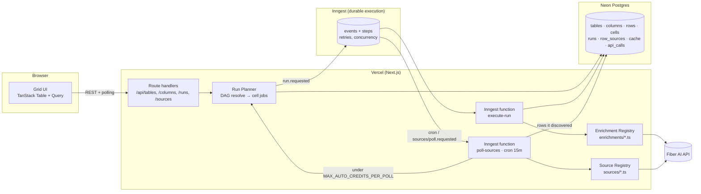
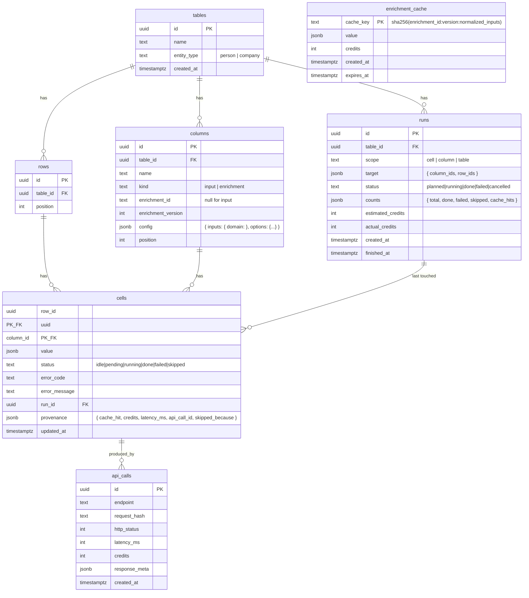
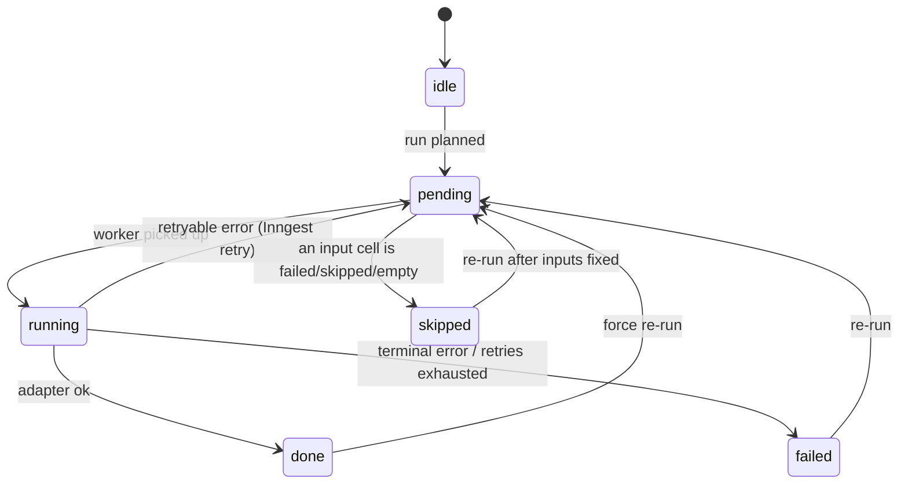

# OpenCeramic — Design Document

**Open-source enrichment spreadsheet on Fiber AI APIs** (a Clay-style grid where columns are enrichments, not data)

| | |
|---|---|
| Author | Ojas |
| Status | Draft v1 |
| Target | Fiber AI take-home — 5–10 hrs, deployed on Vercel, public GitHub repo |
| Stack | Next.js 15 (App Router) · TypeScript · Postgres (Neon) · Drizzle · Inngest · TanStack Table/Query · shadcn/ui · Zod · Vitest |

---

## 0. TL;DR

A spreadsheet is the wrong mental model for this product; it is only the *rendering*. Underneath, a table is a **DAG of typed enrichment columns**, and a "run" is a **topologically-ordered, concurrency-bounded, cache-aware, partially-failing batch of API calls** against Fiber. This doc designs that engine first, and the grid second.

The three things I want a reviewer to notice in the first five minutes:

1. **Adding a new enrichment is one file.** The engine knows nothing about specific Fiber endpoints; adapters declare input/output schemas and a run mode (`sync` / `async` / `batch`) and the engine does the rest.
2. **Runs are durable and resumable.** Every cell has a status, a provenance record, and an idempotent execution key. A failed cell never poisons its siblings; downstream cells are `skipped` with a reason, not silently blank.
3. **It respects credits.** Cost is estimated before a run, identical inputs are served from cache, and the live credit balance is always visible.

---

## 1. Problem and scope

### 1.1 What a user does

1. Create a table of **people** or **companies**; seed rows via CSV upload or a Fiber search (`companySearch` / `peopleSearch` / natural-language `slushieRun`).
2. Add a column, pick an **enrichment**, and map its inputs to existing columns (e.g. `domain → column "Website"`).
3. Run a cell, a column, or the whole table.
4. Watch cells move through `idle → pending → running → done | failed | skipped`.
5. Export to CSV.

### 1.2 In scope (v1)

- Tables, rows, columns, cells with full state + provenance
- Enrichment registry with 5–6 adapters covering every run mode (see §5)
- Execution engine: DAG resolution, bounded concurrency, retries, caching, partial failure, resumability
- Run progress UI with per-cell state and a credit/cost readout
- CSV import/export; seeded demo table so reviewers can click **Run** without uploading anything

### 1.3 Explicitly out of scope (documented as future work)

- Multi-user auth / orgs (single-tenant; API key from env or BYOK, see §9)
- Formula columns, filtering/sorting of the grid, cell editing of enrichment outputs
- Webhook-based completion (Fiber supports it; polling is simpler and sufficient here)
- AI drafting column — the brief says *exclusively Fiber APIs*. I'll ship it as an optional, clearly-labelled adapter that takes a user-supplied LLM key, disabled by default. *(Confirm with Fiber whether this is welcome or off-brief.)*

---

## 2. Architecture



### 2.1 Why this shape

| Decision | Choice | Why | Rejected alternative |
|---|---|---|---|
| Execution substrate | **Inngest** | Vercel functions time out; a 200-row × 4-column run is 800 calls over minutes. Inngest gives durable steps, retries, per-key concurrency limits, `step.sleep` for polling async Fiber endpoints, and a first-class Vercel integration on a free tier. | Hand-rolled Postgres queue (`SELECT … FOR UPDATE SKIP LOCKED`) drained by a self-reinvoking route. Fully understood, and it's what I'd build without Vercel constraints — but it's fragile on serverless and burns ~3 of 10 hours on plumbing that isn't the interesting part. Documented as an alternative in the README. |
| Source of truth | **Postgres**, cells as rows | Cell status must survive crashes and be queryable ("show me all failed cells in column X"). JSONB for values keeps the schema stable while output shapes vary. | Storing the grid as one JSON blob per table — trivial to read, impossible to update concurrently from 800 workers. |
| Client updates | **Poll run status every 1.5s** | One endpoint, one query, zero infrastructure. Runs are minutes, not milliseconds; sub-second latency buys nothing. | Supabase Realtime / SSE — nicer, but a demo that flakes on WebSockets is worse than one that polls. Listed as a stretch. |
| Fiber client | **Types generated from `openapi.json`** (`openapi-typescript`) + thin fetch wrapper | End-to-end typed request/response with no hand-written DTOs; drift-proof when Fiber ships changes. | Fiber's Node SDK if it exists and is current — use it if so; the wrapper stays either way for auth, logging, and credit accounting. |
| Grid | **TanStack Table** + `@tanstack/virtual` | Headless, virtualized, ~1 hour to a working grid with AI assistance. The grid is not where I want to spend time. | AG Grid / Handsontable — heavier, license friction, and they'd fight the custom cell renderer. |

---

## 3. Data model



### 3.1 Notes that matter

- **A column is a definition, not a header.** `config.inputs` maps each adapter input name to a source column. This is the edge list of the DAG.
- **Cell PK is `(row_id, column_id)`.** Upserts by that key make every write idempotent; there is no separate "job" table because the cell *is* the job record.
- **`provenance` is cheap and disproportionately impressive.** Which run, cache hit or not, credits spent, latency, link to the raw `api_calls` row. Clay users care about "where did this value come from" constantly.
- **`enrichment_version`** on the column pins the adapter contract so cached values from an older adapter version aren't served after the output schema changes.
- **Input columns** (`kind = input`) come from CSV or search; their cells are always `done`.

---

## 4. Execution engine

### 4.1 Cell state machine



### 4.2 Planning (synchronous, in the API route)

```
plan(table, scope, target, { force }):
  1. cols   = enrichment columns in scope (or all, for table scope)
  2. graph  = edges (source_col → col) from every col.config.inputs
  3. order  = Kahn topological sort; reject on cycle (400)
  4. levels = group columns by depth so independent columns run in parallel
  5. for each (row, col) in scope:
       if force        → status = pending
       elif done       → leave (default runs only touch idle/failed/skipped)
       else            → status = pending
  6. estimate = Σ adapter.estimateCredits(inputs) over pending cells
               minus cells whose cache_key already exists
  7. insert run(status = planned, estimated_credits)
  8. emit inngest event "run.requested" { run_id }
  return { run_id, estimate, counts }
```

The UI shows the estimate and asks for confirmation when it exceeds a threshold. Nothing has been billed yet.

### 4.3 Execution (Inngest function `execute-run`)

```
execute-run(run_id):
  levels = load plan
  for level in levels:                       # sequential across levels
    for column in level:                     # parallel across columns
      adapter = registry.get(column.enrichment_id)
      cells   = pending cells for column in run scope

      # 1. Resolve inputs; skip what can't run
      for cell in cells:
        inputs = read source cells per column.config.inputs
        if any input is failed/skipped/null → mark skipped(reason), continue

      # 2. Dispatch by adapter mode
      switch adapter.mode:
        sync:   fan out one step per cell, concurrency key = enrichment_id
        batch:  chunk cells by adapter.batchSize; one step per chunk
        async:  one step to trigger, then step.sleep + poll until terminal

      # 3. Per cell/chunk step (idempotent on step id = run_id:cell_id):
        key = adapter.cacheKey(inputs)
        if cache hit → write cell(done, provenance.cache_hit = true); continue
        try:
          result = adapter.run(inputs, ctx)       # ctx = fiber client + api_calls logger
          write cache(key, result)
          write cell(done, value, provenance)
        catch e:
          if e.retryable → throw RetryableError (Inngest backoff: 1s, 5s, 30s)
          else           → write cell(failed, error_code, error_message)

  finalize run(status, counts, actual_credits from api_calls)
```

**Failure semantics**

- A `failed` cell is terminal for *that* cell; its column continues.
- Downstream cells that depend on a `failed`/`skipped`/empty input become `skipped` with `provenance.skipped_because = { column, reason }`. The user sees *why* a cell is empty.
- Re-running a table with defaults only touches non-`done` cells, so a run interrupted halfway resumes for free.
- **Retryable**: HTTP 429, 5xx, network timeout. **Terminal**: 4xx (bad input, no data found, insufficient credits). "No data found" is a *successful* `done` with `value = null`, not a failure — otherwise every unfindable email looks like a bug.

**Concurrency**

- Inngest concurrency limit keyed on `enrichment_id`, initialised from `GET /v1/rate-limits` at startup (fallback: 5). Different enrichments don't starve each other.
- Batch adapters (`startBatchContactDetails`, `KitchenSinkBulkProfile`) collapse N cells into one call — the biggest single lever on both speed and credits.

**Idempotency**

- Inngest step IDs are `run_id:cell_id` (or `:chunk_n`), so a redelivered event never double-bills.
- The `enrichment_cache` key normalises inputs (lowercase domain, strip `www.`, trim) so `Acme.com` and `acme.com` are one call.

---

## 5. Enrichment adapter interface

```ts
// src/enrichments/types.ts
export type RunMode = "sync" | "async" | "batch";

export interface Enrichment<I, O> {
  id: string;                     // "fiber.company.kitchenSink"
  version: number;                // bump when output schema changes
  label: string;
  description: string;
  entity: "person" | "company" | "any";
  mode: RunMode;
  inputs: z.ZodType<I>;           // what the user must map
  output: z.ZodType<O>;           // what the cell will contain
  outputFields: FieldSpec[];      // for the UI: which output keys can feed downstream columns
  estimateCredits(input: I): number;
  cacheKey(input: I): string;     // normalised
  ttlSeconds?: number;

  // exactly one of the following, matching `mode`
  run?(input: I, ctx: Ctx): Promise<O | null>;
  runBatch?(inputs: I[], ctx: Ctx): Promise<(O | null | AdapterError)[]>;
  start?(input: I, ctx: Ctx): Promise<{ handle: string }>;
  poll?(handle: string, ctx: Ctx): Promise<{ state: "pending" } | { state: "done"; value: O | null } | { state: "failed"; error: AdapterError }>;
}
```

Adapters live in `src/enrichments/<name>.ts` and self-register via a barrel file. The engine never imports a specific adapter. **Adding an enrichment = one file + one export line.** The README will show a 30-line example.

### 5.1 Adapters to ship (one of every mode, chosen so they chain)

| # | Adapter | Fiber endpoint | Mode | Inputs → Output |
|---|---|---|---|---|
| 1 | Resolve company | `kitchenSinkCompany` (`/v1/kitchen-sink/company`) | sync | domain or name → LinkedIn URL, name, HQ, headcount, industry, funding |
| 2 | Company revenue | `getCompanyRevenue` | sync | company LinkedIn URL → revenue estimate |
| 3 | Find person at company | `peopleSearch` with company + title filters | sync | company LinkedIn URL + title query → top match profile |
| 4 | Reveal contact | `startBatchContactDetails` / `pollBatchContactDetails` | **batch** | profile URL → email, phone |
| 5 | Validate email | `emailBounceDetection` | sync | email → deliverability |
| 6 | Social handles | `socialMediaLookupTrigger` / `socialMediaLookupPolling` | **async** | profile URL → X, Instagram handles |
| 7 *(stretch)* | Recent LinkedIn posts | `profilePostsLiveFetch` | sync | profile URL → last N posts (for personalisation) |
| 8 *(stretch)* | Department size | `getDepartmentSize` | sync | company URL → per-department headcount |

**Demo chain shipped in the seed table:**
`Website` → ① Resolve company → ② Revenue, ③ Find CEO → ④ Reveal contact → ⑤ Validate email, ⑥ Social handles

Six columns, four levels deep, three run modes. One click on **Run table** exercises the whole engine.

### 5.2 Row sourcing (list building)

Row sourcing is *not* an enrichment — it creates rows rather than filling cells. Two sources in v1:

- **CSV upload** with header → column mapping. *(Stretch: pass messy CSVs through `startMosaic` / `pollMosaic` — Fiber's own CSV-healing — on import. It's on-brand and a one-adapter addition.)*
- **Fiber search**: `companySearch` / `peopleSearch` with a small structured filter form, plus a natural-language box backed by `nlpSearchParse` → editable structured query → run. This mirrors exactly what the OpenSDR brief asks for, at low cost.

---

## 6. API surface (route handlers)

| Method | Path | Purpose |
|---|---|---|
| `POST` | `/api/tables` | Create table (`name`, `entity_type`) |
| `GET` | `/api/tables/:id` | Table + columns + rows + cells (paged by row) |
| `POST` | `/api/tables/:id/rows/import` | CSV → rows + input cells |
| `POST` | `/api/tables/:id/rows/search` | Fiber search → rows |
| `GET` | `/api/tables/:id/export` | CSV |
| `POST` | `/api/tables/:id/columns` | Add enrichment column (validates input mapping + cycle check) |
| `PATCH`/`DELETE` | `/api/columns/:id` | Rename / remap / remove |
| `POST` | `/api/tables/:id/runs` | Plan a run; returns `run_id` + credit estimate |
| `GET` | `/api/runs/:id` | Progress counts + changed cells since `?since=` |
| `POST` | `/api/runs/:id/cancel` | Cancel (Inngest `cancelOn` event) |
| `GET` | `/api/enrichments` | Registry metadata for the "Add column" picker |
| `GET` | `/api/account` | Fiber credit balance (`getOrgCredits`) + rate limits |
| `POST` | `/api/inngest` | Inngest serve endpoint |

All bodies validated with Zod; all Fiber calls go through one `fiberClient` that logs to `api_calls`.

---

## 7. Frontend

Single page per table. Keep it clean, not clever.

- **Header**: table name · entity badge · live **credit balance** · **Run table** button.
- **Grid**: TanStack Table, virtualized rows. Enrichment columns render a **status chip** (spinner / ✓ / ✗ / ⊘) plus a compact value; click a cell → side panel with full JSON value, provenance, error, and **Re-run cell**.
- **Column header menu**: Run column · Force re-run · Edit mapping · Delete. Header shows the enrichment label and a tiny input-mapping hint (`← Website`).
- **Add column dialog**: pick an enrichment (filtered by table entity type) → for each declared input, choose a source column (only columns whose output fields type-match are offered) → name it → done. Validation surfaces cycles immediately.
- **Run confirmation modal**: "This will run 184 cells (16 cached) · est. 372 credits · balance 4,900." Confirm / cancel.
- **Progress**: a slim bar under the header while a run is active; cells update as the 1.5s poll returns diffs.
- **Empty state**: "Import CSV" · "Build from Fiber search" · "Load demo table".

Design tokens: shadcn/ui defaults, neutral palette, monospace for values. No dark-mode work.

---

## 8. Testing

Tests are where a systems reviewer looks for proof. Keep them small and pointed.

- `planner.test.ts` — topological sort, cycle rejection, level grouping, "default run skips done cells", "force run doesn't".
- `engine.test.ts` — with a **fake Fiber client**: cache hit skips call; failed input → downstream skipped with reason; retryable vs terminal error mapping; batch chunking; async poll loop reaches terminal state.
- `adapters.contract.test.ts` — every registered adapter: `inputs`/`output` are valid Zod schemas, `cacheKey` is stable under input normalisation, `mode` matches implemented methods.
- One Playwright smoke *(stretch)*: load demo table → run → all cells terminal.

Fiber sandbox key for integration runs; unit tests never hit the network.

---

## 9. Security, config, cost

- Fiber API key: `FIBER_API_KEY` env var, server-side only. Never reaches the browser.
- *(Stretch, on-brand for me)*: **BYOK** — user pastes their own key, stored AES-GCM-encrypted at rest with a server secret, referenced by session cookie. Lets Fiber staff try it with their own credits.
- `createSandboxApiKey` exists on the API — try self-serve before emailing.
- Credit guardrails: per-run cap from env (`MAX_CREDITS_PER_RUN`), refuse to plan above it; cache TTL default 7 days.
- Rate limits read from `/v1/rate-limits` at boot; never hardcoded.

---

## 10. Build order and cut lines (10 hrs)

| Hrs | Milestone | Cut line if behind |
|---|---|---|
| 0–1 | Repo, Next.js, Neon, Drizzle schema, generated Fiber types, `fiberClient`, seed script | — |
| 1–2.5 | Enrichment interface + registry; adapters ①②③ (sync); planner with topo sort + tests | Ship only ① and ③ |
| 2.5–4.5 | Inngest `execute-run`: sync path, cache, failure/skip semantics, run finalisation | Drop cancel |
| 4.5–5.5 | Batch adapter ④ and async adapter ⑥ | Drop ⑥ (keep the async path in the interface, documented) |
| 5.5–7.5 | Grid, cell chips, add-column dialog, run modal, polling | Drop side panel; show value/error inline |
| 7.5–8.5 | CSV import/export, demo seed, credit balance in header | Drop Fiber-search row sourcing |
| 8.5–9.5 | README (architecture diagram, "add an enrichment in 30 lines", design decisions, what I'd do next), Vercel deploy, env docs | — |
| 9.5–10 | Record a 2-minute walkthrough, final polish | — |

Non-negotiable for submission: working Vercel URL with the demo table pre-loaded, ≥3 adapters covering ≥2 run modes, the planner + engine tests passing, and a README a founder can read in five minutes.

---

## 11. Risks

| Risk | Mitigation |
|---|---|
| Sandbox key delay | Request on day 0; build against a **fake Fiber client** with recorded fixtures until it arrives. The engine doesn't care. |
| Fiber sandbox returns canned/limited data | Fine for a demo; provenance panel makes it obvious what's real. Note it in the README. |
| Vercel Hobby limits (function duration, Inngest cold starts) | All long work is in Inngest steps; route handlers only plan and read. |
| Grid eats the time budget | Hard cap at 2 hours; it's headless TanStack with AI-generated boilerplate, and it's explicitly not the thing being judged. |
| Scope creep on adapters | The interface is the deliverable; six adapters is plenty. More is a README "next steps" list. |

---

## 11.1 What actually happened to these risks

Recorded after the build, since several played out differently than planned.

| Risk as written | What happened |
|---|---|
| "Sandbox key delay — build against a fake client until it arrives" | The key arrived quickly but **six of the seven adapter operations return 501 "Sandbox mode is not yet available"**, along with Mosaic and both account endpoints. The fake-client decision was right for a reason we did not anticipate: sandbox coverage, not key latency. |
| "Fiber sandbox returns canned data" | True for the one endpoint that works. `peopleSearch` returns `Jane Doe / jane-doe-sandbox`. |
| "Vercel Hobby limits" | Not hit. The real deployment obstacle was **Deployment Protection**, which returns 401 to Inngest Cloud so it cannot reach `/api/inngest`, leaving runs stuck at `planned`. |
| "Grid eats the time budget" | It did not. What ate time was the repository living in an **iCloud-synced folder**: `tsc` took 7–10 minutes (1.3s of CPU), npm tarballs were silently truncated, and iCloud wrote conflict copies into `.git/refs/heads/` that broke `git clone`. Moving to `~/dev` took typecheck to 3 seconds. |

Two design decisions were made under duress and are worth stating:

- **`drizzle-orm/neon-http` has no interactive transactions**, so `upsertCells`
  is not atomic across a batch. Deliberate: the `(row_id, column_id)` cell key
  makes every write idempotent, so a partial batch is a subset of the work, not
  corruption, and the next run re-plans what did not land. The alternative
  (WebSocket driver) costs cold-start latency on serverless for atomicity the
  key already makes unnecessary.
- **Credit estimates over-state.** A cell whose upstream has not run cannot be
  priced against the cache, so it counts as a miss (section 4.2). Users are
  never billed more than they approved.

## 12. Future work (README section, not code)

- Webhook completion for async endpoints (`/v1/webhooks/endpoints`) instead of polling
- Formula and AI columns; conditional runs ("only enrich if revenue > $10M")
- Multi-tenant auth, per-org keys and credit budgets
- Postgres `SKIP LOCKED` worker as an Inngest-free deployment mode for self-hosters

---

## 13. Row sources (built)

Sections 1–12 describe a pull system: a human uploads a CSV and presses Run.
A **row source** makes the table push-based. It polls Fiber on a schedule,
discovers entities, inserts them as rows deduped by identity, and immediately
plans and triggers a run scoped to only those new rows.

### 13.1 The layer rule

A source **discovers entities and creates rows**. An enrichment **fills cells**.
Neither does the other's job. Section 5.2 already said row sourcing is not an
enrichment; this is that statement made structural.

`src/sources/**` mirrors `src/enrichments/**` — `types.ts`, `registry.ts`, one
file per source — and the poller resolves sources through the registry exactly
as the executor resolves adapters. Neither imports a concrete implementation.
The registry validates at register time that a source's `kind` matches its id
(`fiber.source.savedSearch` ⇄ `saved_search`), which is also what lets the
poller find an adapter from the `kind` stored on a `row_sources` row.

### 13.2 Schema

```
row_sources
  id, table_id FK, kind (saved_search | tracker), name,
  config jsonb,            -- validated by the source's own Zod schema
  cursor jsonb,            -- { last_run_id?, last_signal_at?, seen_ids? }
  status (active | paused | error), auto_enrich, error_message, last_polled_at

rows  += source_id FK (ON DELETE SET NULL), identity_key, signal jsonb
```

The dedupe guarantee is a **partial** unique index on
`rows(table_id, identity_key) WHERE identity_key IS NOT NULL`. Partial matters:
CSV rows have no identity, and a total index would make every one of them
collide on null. `insertRowsIfNew` infers that index with a matching predicate
on `ON CONFLICT … DO NOTHING … RETURNING`, so it returns only rows that were
genuinely new.

Deleting a source nulls `source_id` rather than cascading — stopping the polling
should not throw away what it found.

### 13.3 The cursor contract

`poll(config, cursor, ctx) → { rows, cursor, note? }` is pure with respect to
the database, like `processWork` in section 4.3. It takes a cursor and returns
one and never writes.

**A cursor advances only on a poll that completed.** Everything else returns the
cursor unchanged:

| Situation | Cursor |
|---|---|
| Saved search run id equals `last_run_id` | unchanged, no rows |
| Run still `PROCESSING` | unchanged, note "run in progress" |
| Run `FAILED` / `REJECTED_NO_FUNDS` | unchanged |
| Anything thrown | unchanged, error mapped via `toAdapterError` |
| Run `COMPLETED` and paged | `last_run_id` ← the new run |

The reason is asymmetric cost. Advancing a cursor past results nobody read loses
those rows *permanently*, because the next poll asks only for what came after;
failing to advance costs one redundant poll. `pollSource` returns `work.cursor`
by identity on every failure path so no partially-built cursor can escape.

For trackers the cursor is a timestamp plus a bounded tail of the last 500
signal ids. The timestamp does the work; the ids exist because several signals
can share one `observedAt`, and a timestamp alone would either re-import them
every poll or skip whichever it did not see first. The filter is
`observedAt >= last_signal_at AND id ∉ seen_ids`.

### 13.4 Unattended spend

`MAX_AUTO_CREDITS_PER_POLL` (default 200) is separate from, and far below,
`MAX_CREDITS_PER_RUN`. A human pressing Run has seen the estimate; a cron has
not.

The check sits **between `planRun` and `triggerRun`** — the only point at which
a cap can actually prevent spending, since once the executor is running the
credits are already going out. Over the cap: the run is not started, the source
is paused with an explanation, and the cells `planRun` already wrote stay
`pending` for a human to approve.

### 13.5 Sandbox reality

All seventeen saved-search and tracker operations return 501 on a sandbox key
(0 of 17 reachable — see the README's coverage table). The sources are built
against the generated OpenAPI types and served from recorded fixtures, exactly
as the enrichment adapters are. `setup()` attaches each tracker rule twice, once
real and once `isDummy: true`, because dummy rules are the only thing
`fireTrackerDummy` can fire and creating them is free — that is what makes
"Fire test signal" work end to end.

### 13.6 Known limits

- **Cross-source identity.** A saved-search company keys on its domain; a
  tracker signal carries no domain at all, only a LinkedIn URL, so it keys on
  that. Two sources on one table can therefore insert the same company twice.
  Resolving it would require an enrichment call, which a source must not make.
- **Poll overlap.** `concurrency: { limit: 1, key: "event.data.sourceId" }`
  stops a source overlapping itself and stops cron sweeps overlapping each
  other, but a sweep can still overlap an on-demand poll of the same source.
  The cost is a duplicate Fiber call and a redundant run, never a duplicate row.
- **Row position.** `createRows` and `insertRowsIfNew` derive `position` inside
  the INSERT, but `drizzle-orm/neon-http` has no interactive transactions to
  hold a lock across statements, so two inserts genuinely in flight together can
  still collide. `getTableWithData` therefore orders by `(position, id)`: ties
  are possible, and deterministic.
